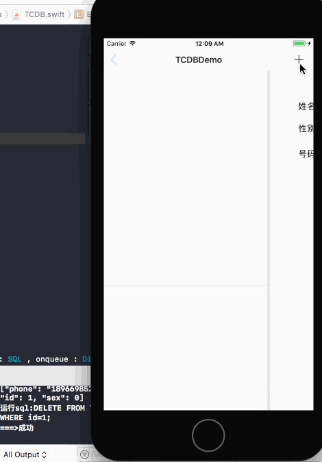

# TCDB

[](https://travis-ci.org/itanchao/TCDB)
[](http://cocoapods.org/pods/TCDB)
[](http://cocoapods.org/pods/TCDB)
[](http://cocoapods.org/pods/TCDB)

## Example

To run the example project, clone the repo, and run `pod install` from the Example directory first.

## Requirements

## Installation

TCDB is available through [CocoaPods](http://cocoapods.org). To install
it, simply add the following line to your Podfile:

```ruby
pod "TCDB"
```

* API

  ```swift
      /// 打开数据库
      ///
      /// - Parameter DBName: 数据库名称
      public class func openDB(DBName: String) -> Bool 
      
      /// 执行语句
      ///
      /// - Parameters:
      ///   - method: 操作方法
      ///   - sql: sql语法
      ///   - onqueue: 线程
      ///   - callback: 回调
    public  class func execSql( _ method : EXECSQLMethod, sql : SQL , onqueue : DispatchQueue = dbQueue ,  callback:@escaping ((Any)->()) )
  ```

* 使用

  ~~~swift
   func openDB() {
        if TCDB.openDB(DBName: "TCDB-Example.sqlite") {
            creatTab()
        }
      }
    /// 创建表格
   func creatTab()  {
      //1、编写SQL语句
      let sql = "CREATE TABLE IF NOT EXISTS TB_EXAMPLE_FRIENDLIST \n" +
          "(\n" +
          "id INTEGER PRIMARY KEY AUTOINCREMENT,\n" +
          "name TEXT NOT NULL,\n" +
          "sex INT DEFAULT 0,\n" +
          "phone TEXT NOT NULL);"
      // 2.执行
      TCDB.execSql(.create, sql: sql) { (result) in
          let sucess = result as! Bool
          print("运行sql:\(sql)\n===>\(sucess == true ?  "成功" : "失败")")
      }
  }
      /// 插入
    func inSertSql(name : String,sex : Bool = false , phone:String ){
      let sql = "INSERT INTO TB_EXAMPLE_FRIENDLIST (name,sex,phone) VALUES (\n"
          + "'\(name)',\(sex ? 1 : 0 ),\(phone));";
      TCDB.execSql(.insert, sql: sql) { (result) in
          let sucess = result as! Bool
          print("运行sql:\(sql)\n===>\(sucess == true ?  "成功" : "失败")")
      }
    }
    /// 更新
    func updateSql( id : String , name : String? , sex : Bool , phone : String?) {
          var sql  = "UPDATE TB_EXAMPLE_FRIENDLIST SET \n"
          if name != nil {
              sql +=  " name = '\(name!)' ,"
          }
              sql +=  " sex = \(sex == true ? 1 : 0) ,"
          if phone != nil {
              sql +=  " phone = \(phone!) "
          }
              sql += "WHERE id = \(id)"
          TCDB.execSql(.update, sql: sql) { (result) in
              let sucess = result as! Bool
              print("运行sql:\(sql)\n===>\(sucess == true ?  "成功" : "失败")")
          }
      }
      /// 查询
    func selectSql( str : String?,callback:@escaping (([[String : Any]])->())) {
        var sql = "SELECT * FROM TB_EXAMPLE_FRIENDLIST \n"
        if  str != nil {
            sql += "WHERE \n"
            sql += "name like \("%\(str!)%") OR \n"
            sql += "sex like \("%\(str == "男" ? 1 : 0)%") OR \n"
            sql += "phone like \("%\(str!)%") \n"
        }
        TCDB.execSql(.select, sql: sql) { (result) in
            callback(result as! [[String : Any]])
        }
    }
    /// 删除
    func deleteSql(_ id : String) {
        let sql = "DELETE FROM TB_EXAMPLE_FRIENDLIST \n"
            + "WHERE id=\(id);"
        TCDB.execSql(.delete, sql: sql) { (result) in
            let sucess = result as! Bool
            print("运行sql:\(sql)\n===>\(sucess == true ?  "成功" : "失败")")
        }
      }
  ~~~

  

## Author

itanchao, itanchao@gmail.com

博客地址:[TCDB的简单使用](https://itanchao.github.io/2017/06/23/TCDB.html)

## License

TCDB is available under the MIT license. See the LICENSE file for more info.
